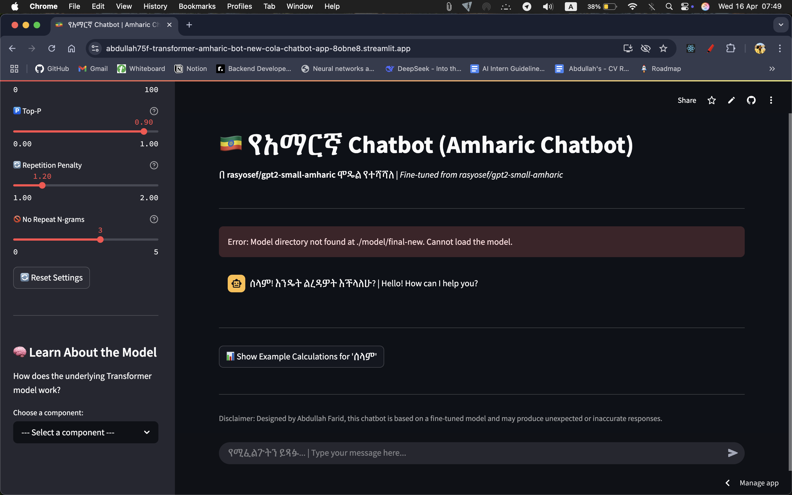
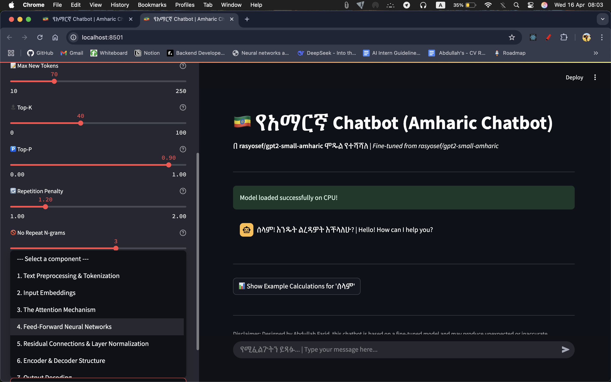
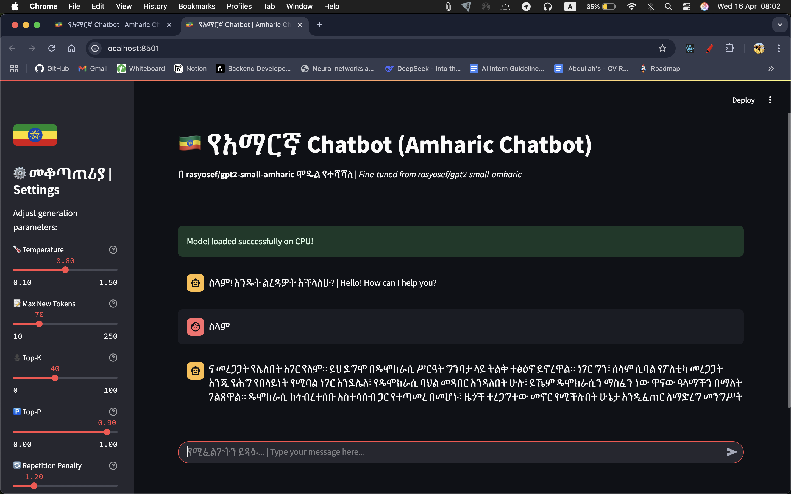

# Transformer-Amharic-Bot-New-Colab

Fine-tuning `rasyosef/gpt2-small-amharic` for Amharic text generation using Google Colab and Hugging Face Transformers. Includes a command-line test chatbot and setup instructions for a local Streamlit app.

**✨ Live Demo:** [**https://abdullah75f-transformer-amharic-bot-new-cola-chatbot-app-8obne8.streamlit.app/**](https://abdullah75f-transformer-amharic-bot-new-cola-chatbot-app-8obne8.streamlit.app/) ✨

## Features

*   Fine-tunes `rasyosef/gpt2-small-amharic` on a custom Amharic corpus.
*   Handles data cleaning, tokenization, training, and evaluation.
*   Saves the trained model to Google Drive.
*   Includes a basic command-line chatbot in the notebook.
*   Provides setup for a local Streamlit chatbot (requires `chatbot_app.py`).

## Screenshots


| Chat UI (Streamlit)                 | Sidebar Notes (Streamlit)        | Model Calculations (Streamlit)   |
| :---------------------------------- | :------------------------------- | :------------------------------- |
|            |      | |

## Setup and Usage

### 1. Google Colab (Training)

1.  **Open Notebook:** Upload and open the `.ipynb` file in Google Colab.
2.  **Data:** Place your `raw-corpus.txt` in the Google Drive path specified in the notebook config (e.g., `/content/drive/MyDrive/Amharic_Chatbot/`).
3.  **Run:** Execute all cells (`Runtime` -> `Run all`). Connect Drive when prompted.
4.  **Output:** The fine-tuned model is saved to Google Drive (e.g., `/content/drive/MyDrive/Amharic_Chatbot/models/amharic-gpt-finetuned/final-new`).

### 2. Local Chatbot (Streamlit - Requires `chatbot_app.py`)

1.  **Clone Repo & Get Model:** Clone this repository and download the saved fine-tuned model files from your Google Drive. Place the model files in the path expected by `chatbot_app.py` (e.g., `./model/final-new/`).
2.  **Setup Environment:**
    ```bash
    # Create & activate a virtual environment (recommended)
    python3 -m venv venv
    source venv/bin/activate  # Adjust for your OS/shell

    # Install dependencies (ensure requirements.txt exists)
    pip install -r requirements.txt
    ```
3.  **Run App:**
    ```bash
    streamlit run chatbot_app.py
    ```

## Key Dependencies

*   `torch`
*   `transformers`
*   `datasets`
*   `sentencepiece`
*   `accelerate`
*   `streamlit` (for local app)

*(See `requirements.txt` for the full list for the local app)*

## Disclaimer

This is a fine-tuned model. Generated responses may be inaccurate or reflect data biases.